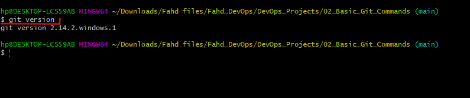
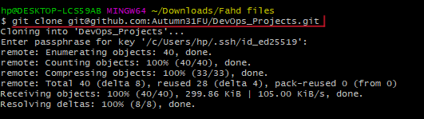
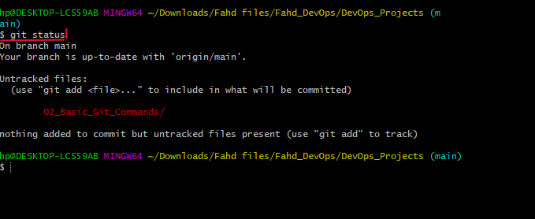
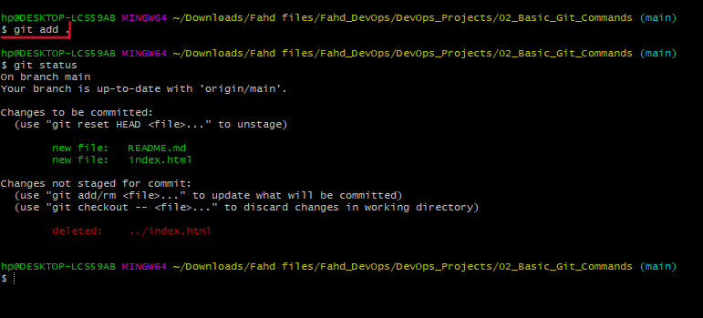
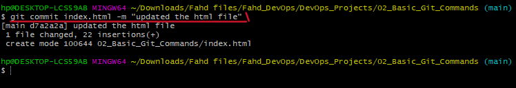
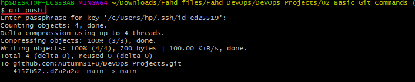
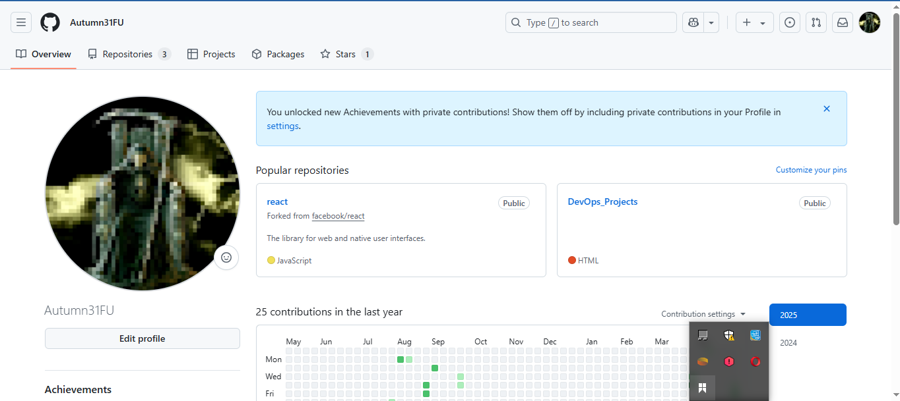
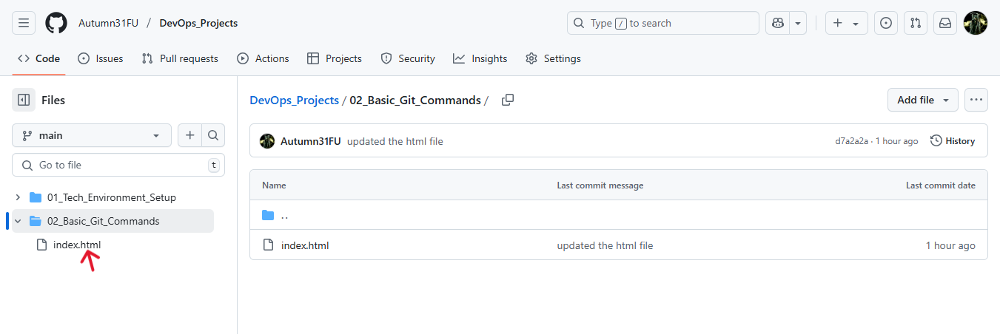

## This markdown contains screenshots of Git version control basics

### Git version
This command checks the git version currently run on the local machine

### Git clone
This command clones repository from the remote to  local 

### Git status
This command checks the current state of working directory and staging area

### Git add
This command adds file to the staging area that will be committed

### Git commit

This command takes a snapshot of staged changes that will be pushed to the remote repository

### Git push
This command pushes changes committed to the remote repository 

### Github dashboard
A screenshot of my github dashboard

### Github Repository url
A repository with an index.html file in its root and a url to the repository

https://github.com/Autumn31FU/DevOps_Projects.git

https://github.com/Autumn31FU/DevOps_Projects/blob/335fa95c22b3301f90c5504a1e35422176c50635/02_Basic_Git_Commands/index.html

