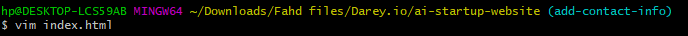

# Collaborative Website Development with Git and Github

This project simulates the workflow of Tom and Jerry using Git and Github. This hands-on project will include installation of Git, setting up a GitHub repository, cloning the repository, creating branches, making changes, and merging those changes back into the main branch.

### Installation of Git
Confirmed installation of git by running **git version** command

### Created a new Github Repository
Created new repository called *ai-startup-website*

### Creating Directory
Created a new directory with **mkdir** command where the the *ai-startup-website* repository will be cloned into 

### Cloning Repository
Cloned the *ai-website-repository* using **git clone**

### Changing Directory

Changed directory into the *ai-startup-website* directory using **cd** command

### Creating an empty file 
Created a new index.html file using the **touch command**

### Adding content to the empty file
Updated the file using **vim**

### Checking file status
Checked file status using **git status** command

### Adding changes to staging area
Added file to staging area using **git add** command and confirming it with **git status** command

### Committing changes
Committed changes made by running **git commit** command

### Pushing changes
Pushed the changes to the remote repository using **git push**

 

# Part 2: Simulating Tom and Jerry's Work 

 

## Tom

### Navigating to Project Directory
Moved backed into the project directory *ai-startup-website* using **cd** command

### Checking current branch
Checked the current branch using **git branch** command

### Creating new branch

Created a new branch *update-navigation* for Tom using **git checkout -b**

### Confirming new branch
Confirmed the new branch with **git branch** command again

### Adding content to Tom's branch
Updated the file in the new branch using **vim**

### Checking staged changes
Checked the file status using **git status** command

### Adding new changes to Staging Area
Added the file to staging area with **git add**

### Confirming new changes in Staging Area
Confirmed file is being tracked with **git status** command again

### Committing changes
Committed the changes to the new branch *update-navigation* with **git commit**

### Pushing changes
Pushed the changes with **git push**

# Jerry

### Switching back to main branch
Switched backed into the *main* branch using **git checkout**

### Pulling latest changes from tom's branch
Pulled the latest changes from tom's branch using **git pull**

### Creating Jerry's branch
Created a new branch for jerry using **git checkout -b** command

### Updating Jerry's file
Updated jerry's file using **vim**

### Adding Jerry's file to staging area
Added the new changes to staging area with **git add**

### Committing Jerry's changes
Committed jerry's changes with **git commmit**

### Pushing Jerry's changes

Pushed jerry's changes with **git pull**

