# Git Branching and Merging

This project simulates the merging of branches created by Tom and Jerry in Git

### Navigate into main branch 
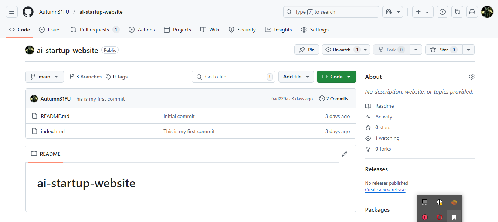

### Switch branch into Tom's branch *update-navigation*
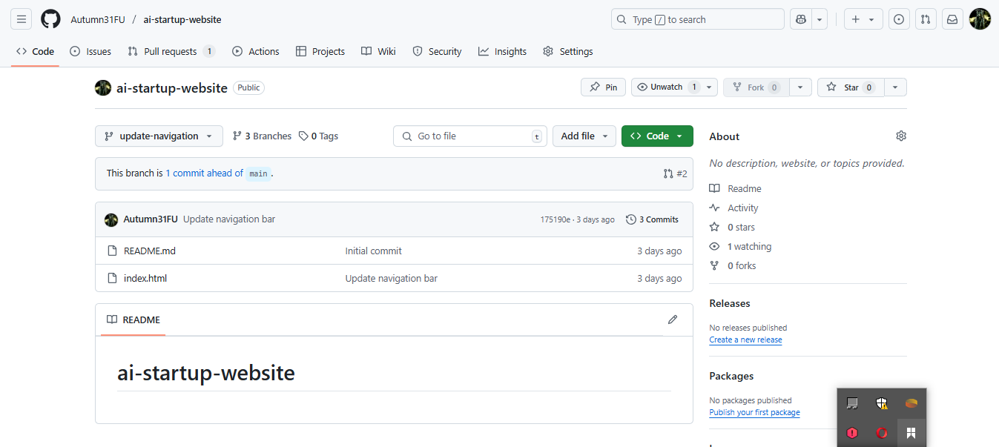

### Create Pull request 
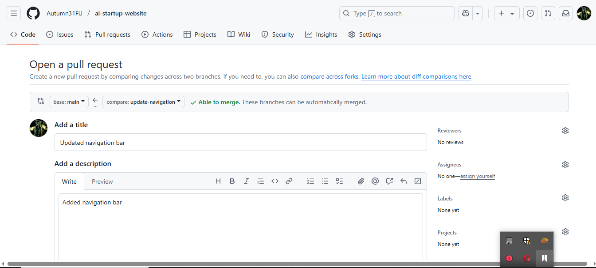

### Confirm Pull request 
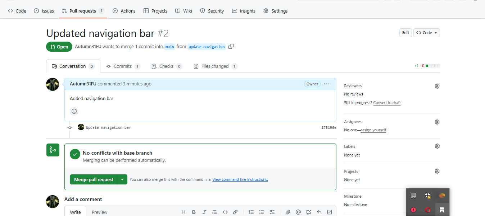

### Merge 
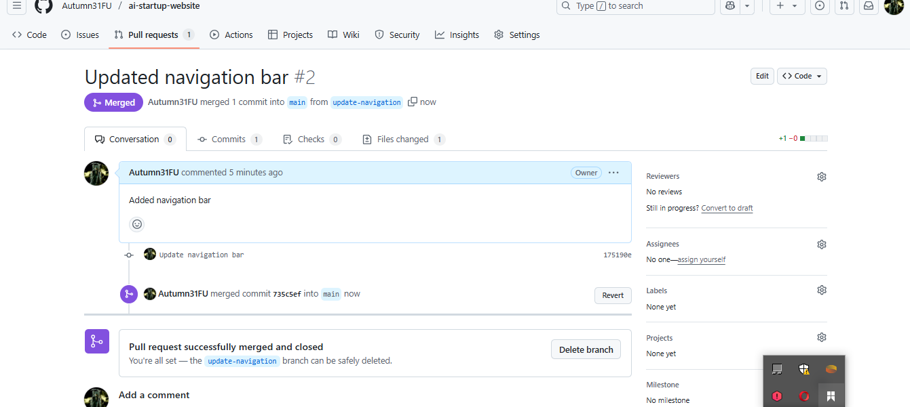
  
 

# Part 2: Updating jerry's branch

### Switch to jerry's branch *add-contact-info* on terminal 
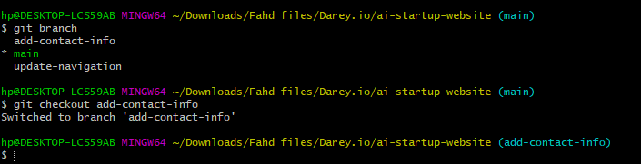

### Pull latest changes 
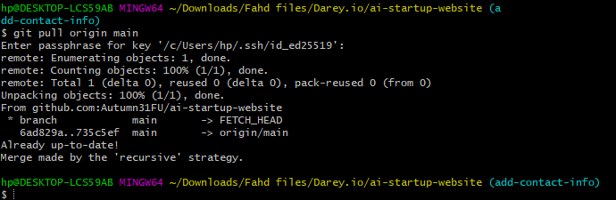

### Create Pull request
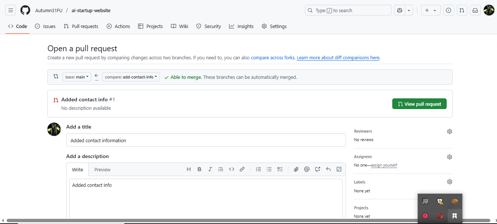

### Confirm Pull request 
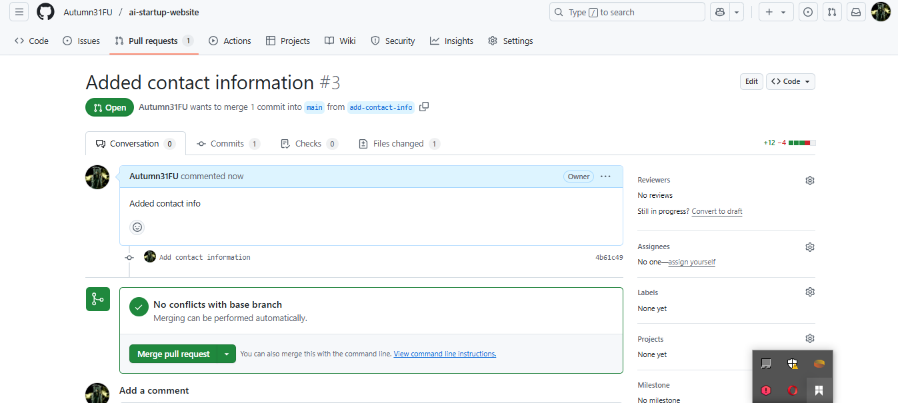

### Merge
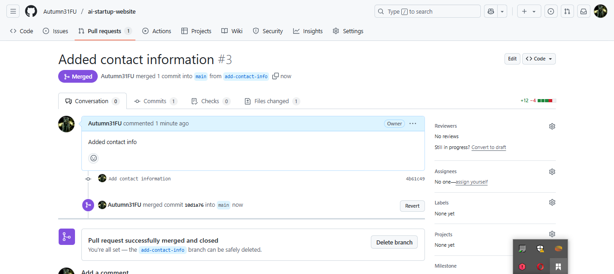

### Confirm Pull request in the main repository 
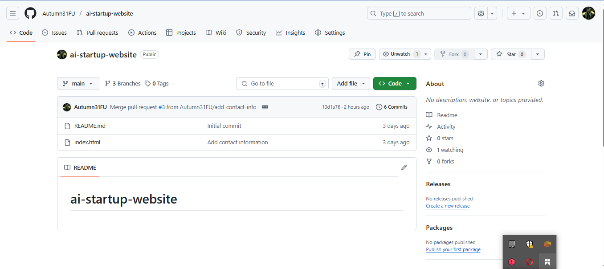