# Capstone Project - Git 

This project simulates the use of Git and GitHub by two developers Morgan and James to enhance a community website

## Objectives 

- Practice cloning a Repository and working with branches 
- Staging, Committing and Pushing changes from both developers
- Create pull requests and merge them after resolving any potential conflicts

 

### Created a new repository **greenwood-library-website**

### Cloned the new repo to local machine 

### Created new files for the **main** branch 

### Staged the changes 
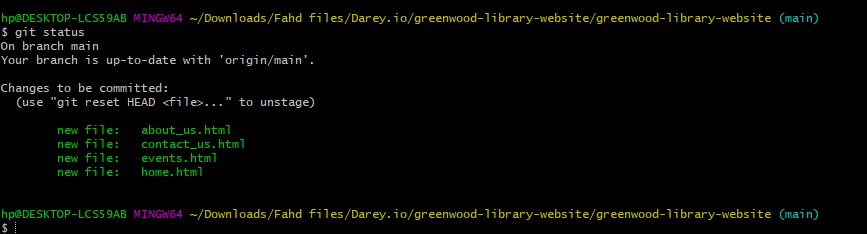

### Committed the changes
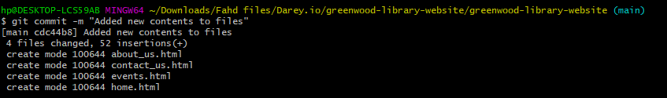

### Pushed changes
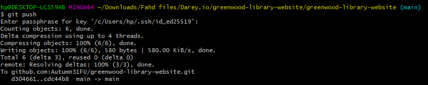

## Morgans branch

### Created and switched to a new branch **add-book-reviews**  
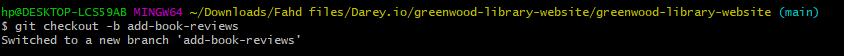

### Created new file **book-reviews** and added content to it 
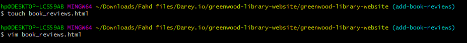

### Staged new changes 
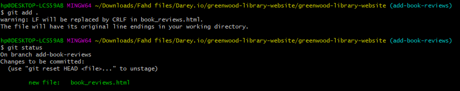

### Committed new changes 
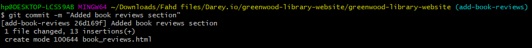

### Pushed new changes 
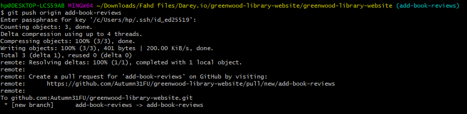

### Created pull request 
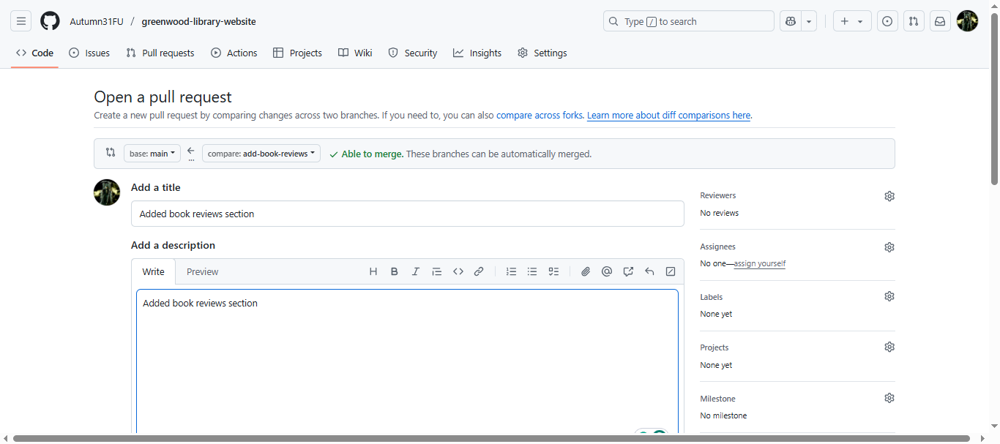

### Reviewed pull request 
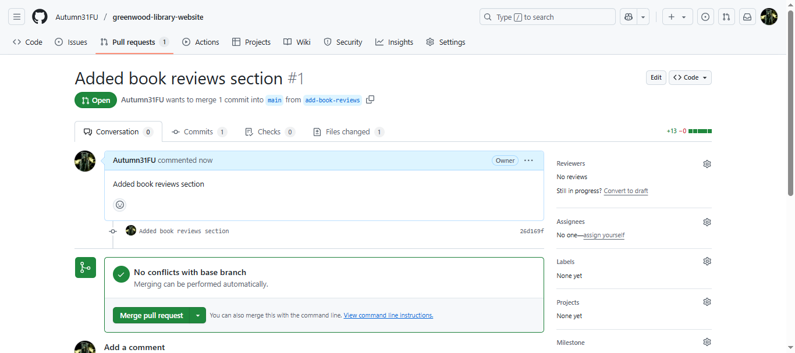

### Merged new changes
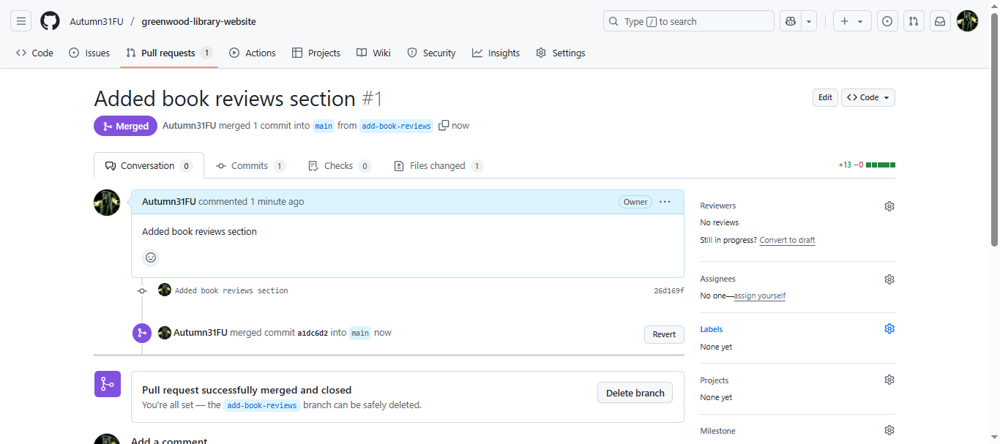

## James branch

### Pulled latest changes from **main** branch  
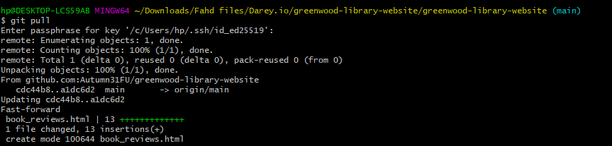

### Created and switched to a new branch **update-events**  
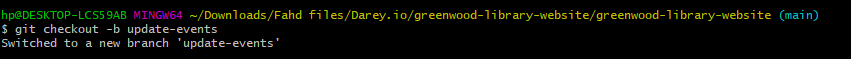

### Added content to **events-page** 
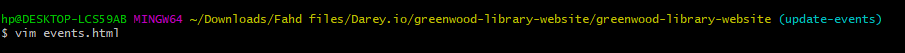

### Staged new changes 
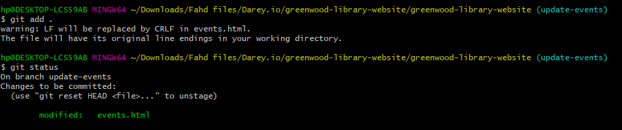

### Committed new changes 
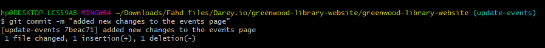

### Pushed new changes 
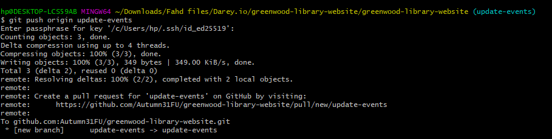

### Created pull request 
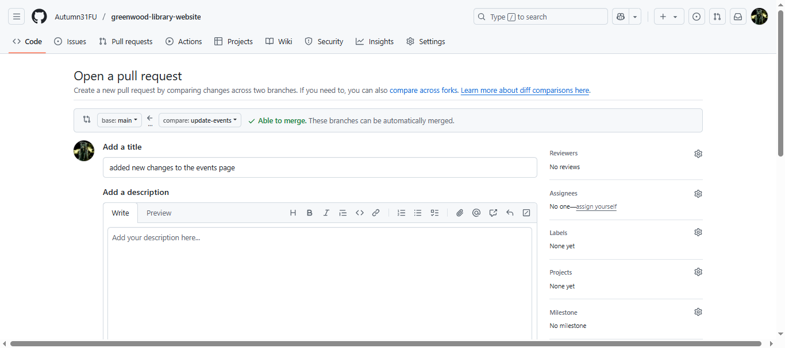

### Reviewed pull request 
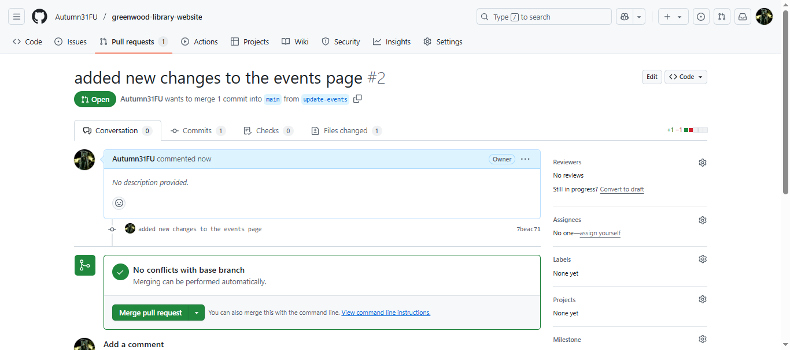

### Merged new changes
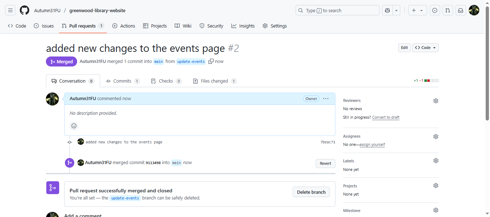

