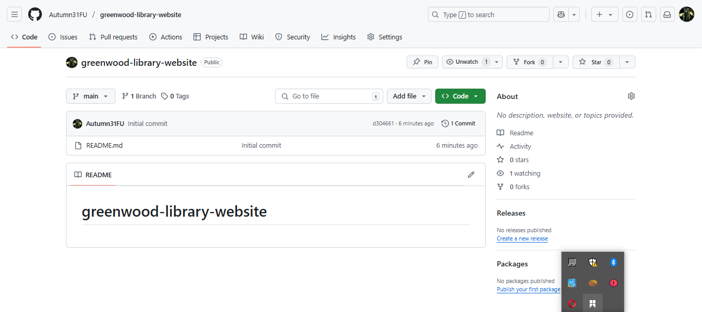
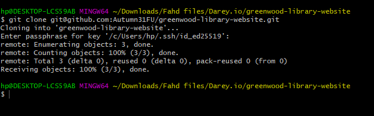
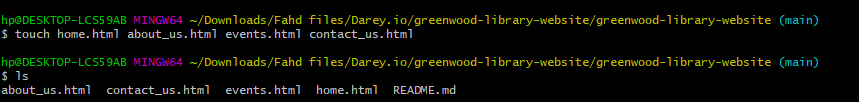
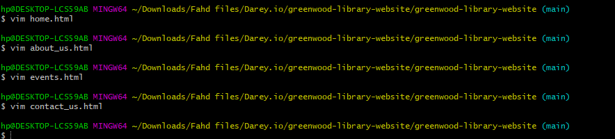

# Capstone Project - Git 

This project simulates the use of Git and GitHub by two developers Morgan and James to enhance a community website

## Objectives 

- Practice cloning a Repository and working with branches 
- Staging, Committing and Pushing changes from both developers
- Create pull requests and merge them after resolving any potential conflicts

 

### Created a new repository **greenwood-library-website**

### Cloned the new repo to local machine 

### Created new files for the **main** branch 

### Staged the changes 

### Added content to the new files 

### Added content to the new files 

### Added content to the new files 

### Added content to the new files 

### Added content to the new files 
