# Linux fundamentals Mini Project
 


### What is Linux

Linux is a family of open-source operating systems based on the Linux kernel. It's known for its flexibility, security, and wide range of uses, powering everything from smartphones and servers to supercomputers and embedded systems. It's a popular alternative to proprietary operating systems like Windows and macOS


### Linux Distributions

A Linux distribution, or "distro," is a complete operating system built on the Linux kernel, including a collection of software and tools. These distributions cater to diverse user needs, from general-purpose desktops to specialized environments like servers or penetration testing

### Examples of Linux Distributions
- Ubuntu
- CentOS
- Debian
- Fedora

## Objectives

- Setting up an EC2 instance i.e Linux server
- Installing client tool
- Connecting to linux server using SSH
- Installing, Updating and Removing Software

<br> <br> 

## Sign-in to AWS 

Sign-in as `Root user`

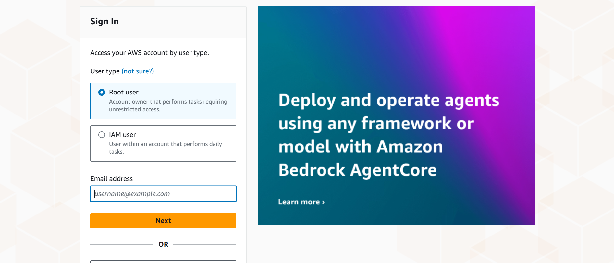

<br>

## Navigate to Console Page

Click on `EC2`

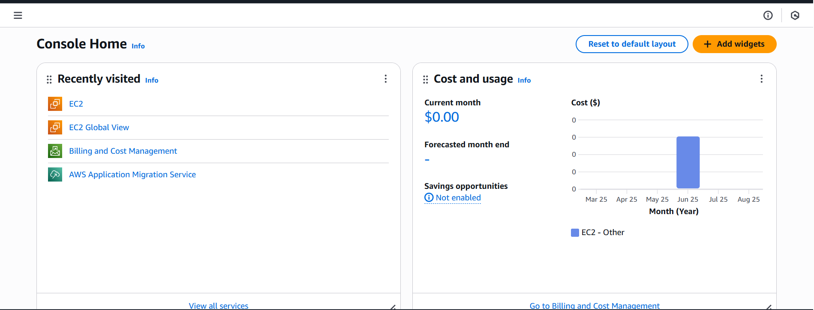

<br>

## Navigate to Instance Page

Click on `Instances` or `Launch instance`

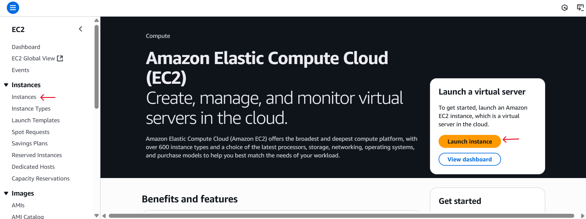

<br>


## Select Instance to Connect to

Click and run EC2 Instance `AServer` then copy public IP address

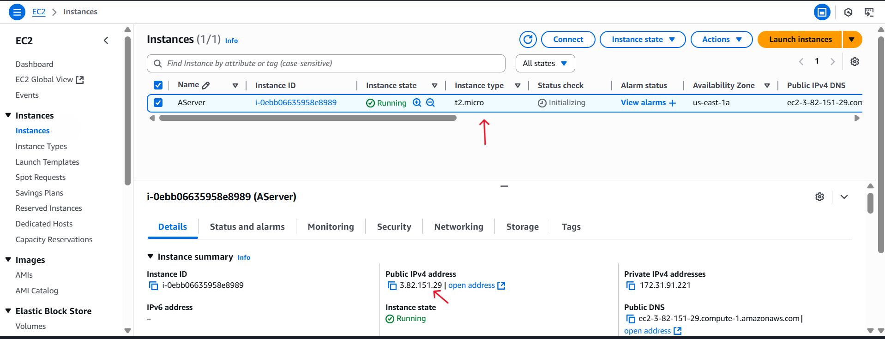

<br>


## Launch client tool MobaXterm

Install and launch client tool such as `MobaXterm`

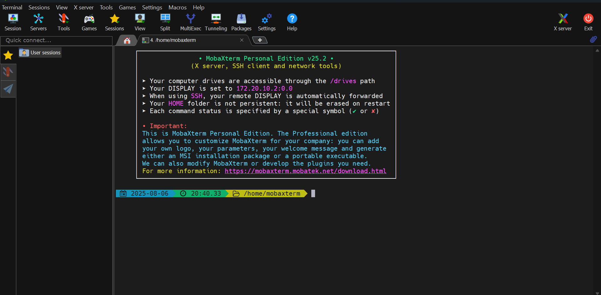

<br>


## Locate Pemkey

Locate and change directory to where the pemkey  `Autumn-EC2.pem` is stored

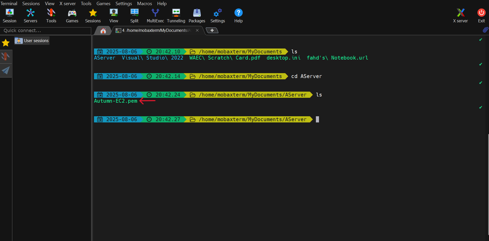

<br>

## Identify the EC2 Instance IP Address

Copy the EC2 Instance `AServer` Public IP Address


<br>

## Connect to Server via SSH

Copy and paste the IP Address and keypair then run this command

 ```
 ssh - "ubuntu.pem" ubuntu@public_ip_address
```
<br>

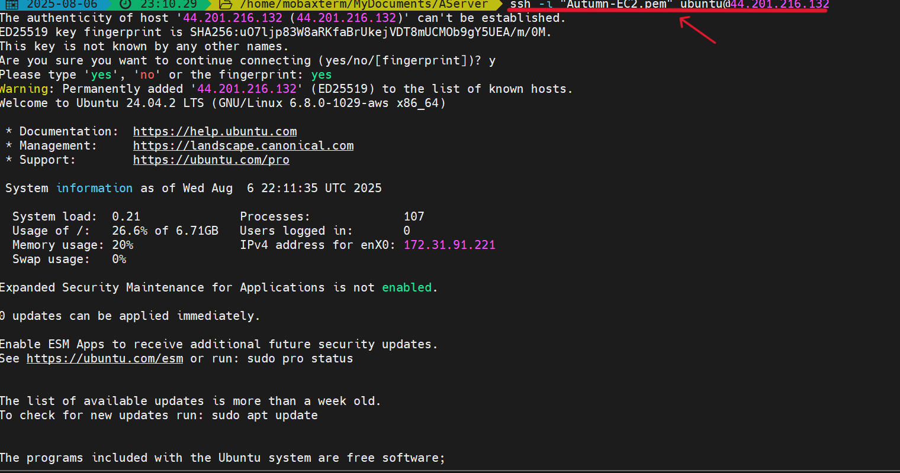

<br>

## Updating Package List

Update the Package List by running this command
```
sudo apt update      # For Debian/Ubuntu-based systems
sudo yum update      # For Red Hat/Fedora-based systems

```
<br>

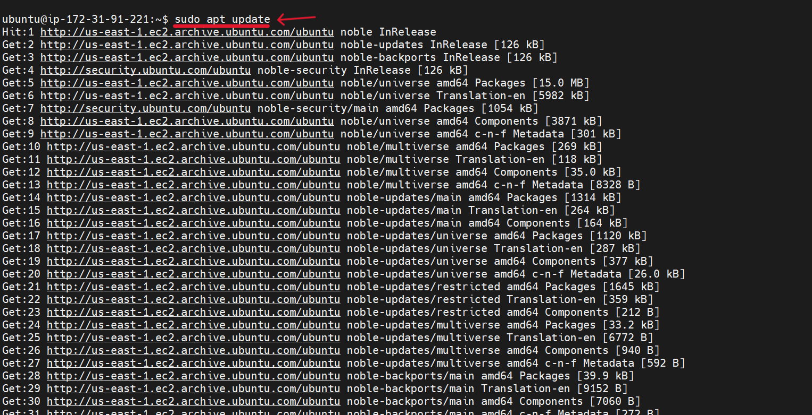

<br>


## Install Software Package `tree`

Install the Package `tree` using the command
```
sudo apt install tree
```
<br>

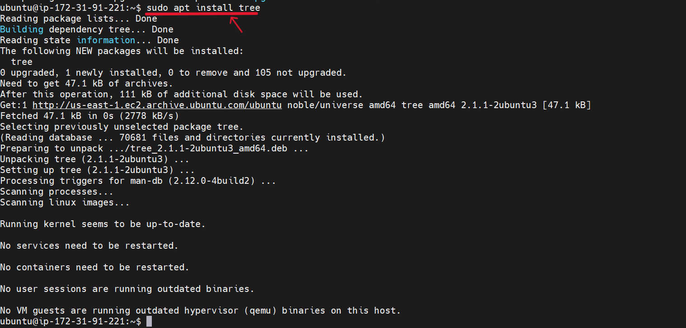

<br>

## Verify Installed Package

Verify the installed package `tree` by running the command
```
tree / - L 1
```
<br>

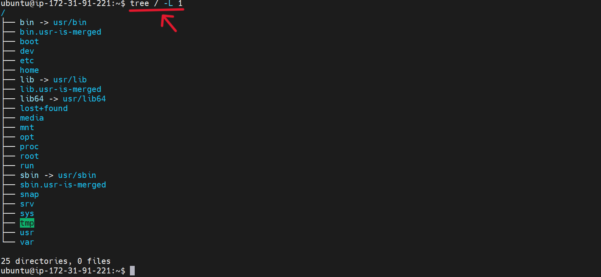

<br>


## Update Installed Packages

Update installed packages by running the command
```
sudo apt upgrade
```
<br>

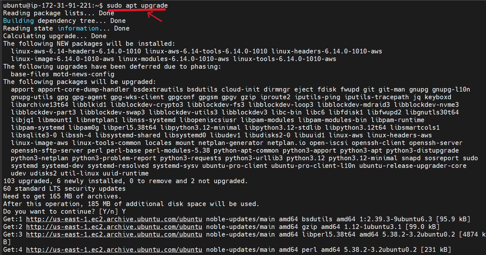

<br>


## Removing Installed Package `tree`

Remove the installed package `tree` running the command
```
sudo apt remove tree
```
<br>

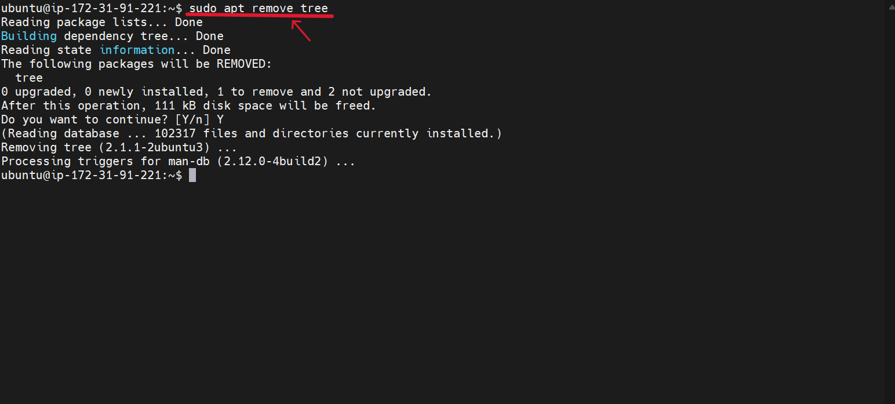


