# Basic Linux Commands


### What is Linux Command
A Linux command refers to a program or utility that runs in the command-line interface (CLI). The CLI is a text-based environment where you interact with the system by typing commands.

Linux command are executed by entering text in the Terminal and pressing Enter. These commands enable me to perform a wide range of tasks, including installing packages, managing users, manipulating files and directories, comfiguring system settings, and more.
```
CommandName [option(s)] [parameter(s)]
```
**CommandName**: This represents the action or task I want to perform using the command, e.g ``ls`` to list files in a folder.

**Option or Flag**: An option modifies the behavior of a command. it is typically preceded by a hyphen (-) or double hyphen (--). For example to show extra information for each listed file, we use `ls -l`

**Parameter or Argument**: A parameter provides specific information or data required by the command to execute the desired action. For example to create a new directory we use ``mkdir`` command. The parameter will be the name of the directory we pass to it, e.g. ***mkdir documents***.

## Manipulating files and directories on Linux

### The sudo command 

In Linux, some actions need special permission to be carried out, like creating files in certain areas like in root directory or changing important system settings like systemctl. `sudo` stands for ***superuser do***. and it allows me to run commands with the security privileges of another user, typically the superuser or root.

### Why use sudo

**Security:** It helps in keeping the system secure by limiting access to powerful commands.

**Tracking:** It logs whoexecuted which command, adding a layer of accountability

###  How sudo Works:

When a command is preceded with sudo, Linux asks for the user password. Once entered correctly, one can run sudo commands as if one is the system's superuser for a short period of time (usually 15 minutes). This means the password is not needed for each sudo command within the timeframe.

### Creating a Directory with sudo

Sometimes superuser privileges is needed to create a directory in certain locations of the file system. Here is how i do it:

1. Open terminal and connect to the linux server using **SSH**

<br>

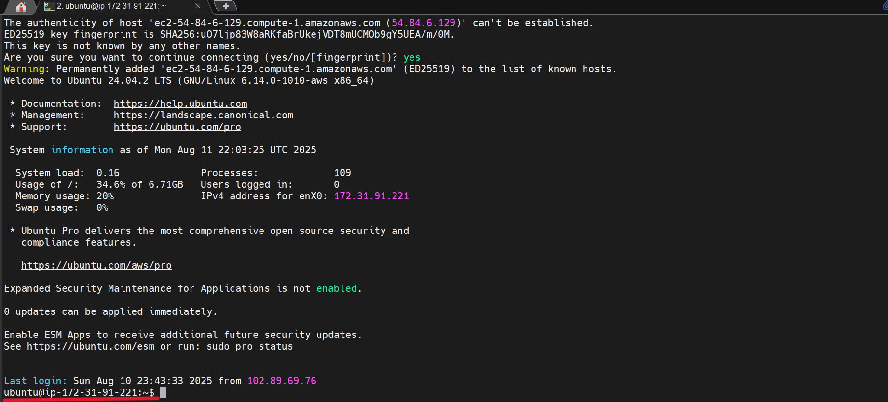

<br>

2. Try creating a folder named ***example*** in a restricted location  e.g the root directory, Which is reserved for the root user, using this command

```
mkdir /root/example

```
- Observe the failure: Permission is denied


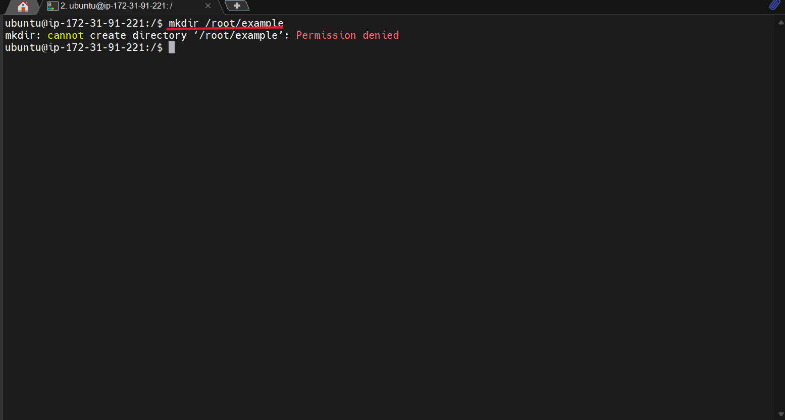
<br>

This error occurs because regular users do not have the necessary permission to create directories in /root.

4. Use the `sudo` command to successfully create the folder
```
sudo mkdir /root/example

```
<br>


***Press Enter:*** Because the sudo command is now included, it executes successfully without error. in some cases one may be prompted to provide a password.

***Verify the folder's creation:*** 
check the folder's existence by using the ``ls`` command.
```
sudo ls /root
```
<br>

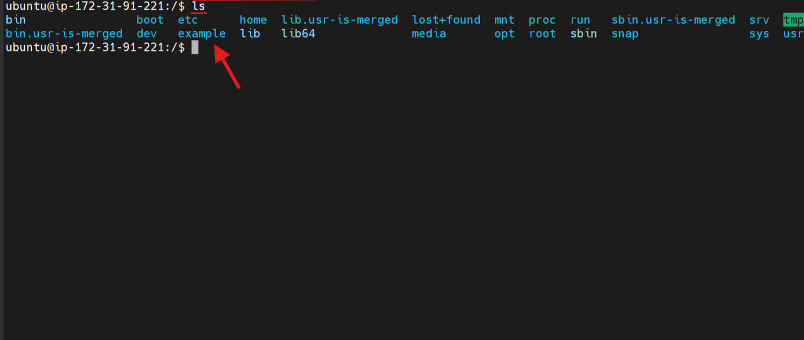

<br>

## pwd command
Use the `pwd` command to find the path to the current working directory. Simply entering `pwd` will return the full current path - a path of all directories that starts with a forward slash ( / ).

<br>


<br>

## The Root Directory ("/")

At the top of Linux filesystem hierachy is the root directory, denoted by a single slash (/). Unlike Windows, which uses different drives (**C**, **D**, etc.), Linux organizes everything starting from the root directory which is the parent directory in all the directories present in the filesystem. Some other essential directories in Linux include:

**/bin**: Essential user commmand binaries that need to be available to all users are stored here (e.g., ls,cp).

**/etc:** Configuration files for the system can be found here.

**/home:** Personal directories for different users.

**/root:** The home directory for the root user.

**/var:** Variable data like logs.

**/usr:** Secondary hierachy for user data; contains majority of the user utilities and applications.

## cd command

To navigate through the Linux files and directory, use the cd command.
To confirm the path use the `pwd`

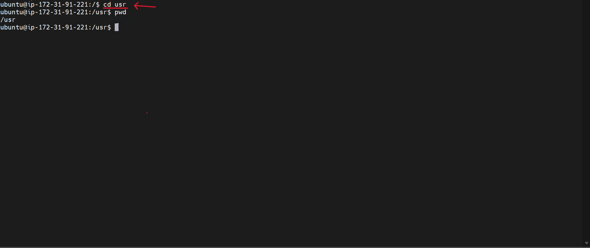

<br>

## Side Hustle Task 1
### 1. Create a directory called `photos` directory
Use the command `mkdir`


### 2. Navigate into the `photos` directory

Use the command `cd`

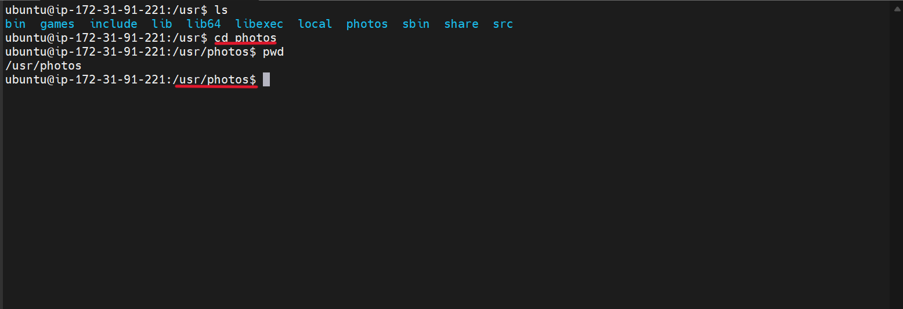

### 3. Create three more random directories inside the  `photos` directory
Create three more directories `camera` `whatsapp` `snapchat`
with the `mkdir` command


### 4. Show the newly created directories

Use the `ls` command to list the new directories

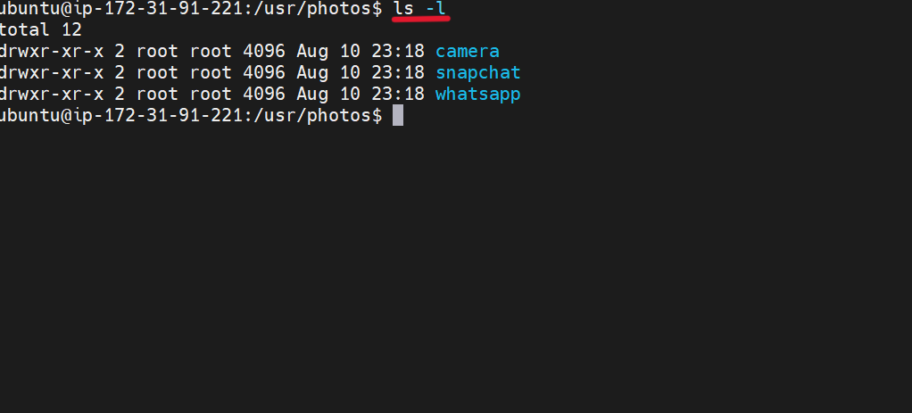

### 5. Navigate into one of them
Navigate into one of the directories using the `cd` command


### 6. Show the full path to the current directory
Use the `pwd` command to show the full path of the current directory 


## ls command

The `ls` command lists files and directories. Running it without a flag or parameter will show the current working directory's content.

To see other directories content, type the `ls` followed by the desired path. 

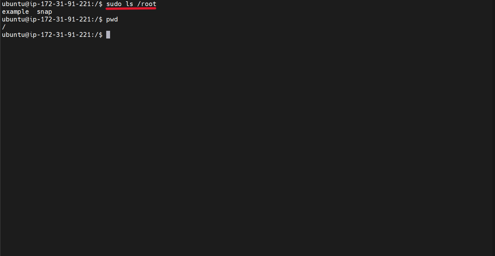

Here are some options to use with the `ls` command

```
ls -R lists all the files in the subdirectories.
ls -a shows hidden files in addition to the visible ones.
ls -lh shows the file sizes in easily readable formats, such as MB, GB, and TB.

```

## cat command

**Concatenate**, or `cat`, is one of the common command in Linux. It lists, combines, and write file content to the standard output (i.e terminal console). To run cat command, type `cat` followed by the file name and it extension. For example:

```
sudo cat /etc/os-release
```
<br>

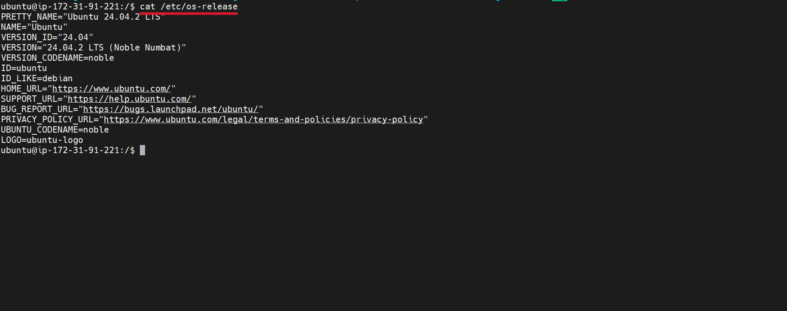

## cp command
The `cp` command is used to copy files and directories with their content.

To copy one file from the current directory to another, enter the `cp` followed by the file name and the destination directory. 


To copy multiple files to a directory, enter the file names followed by the destination directory  

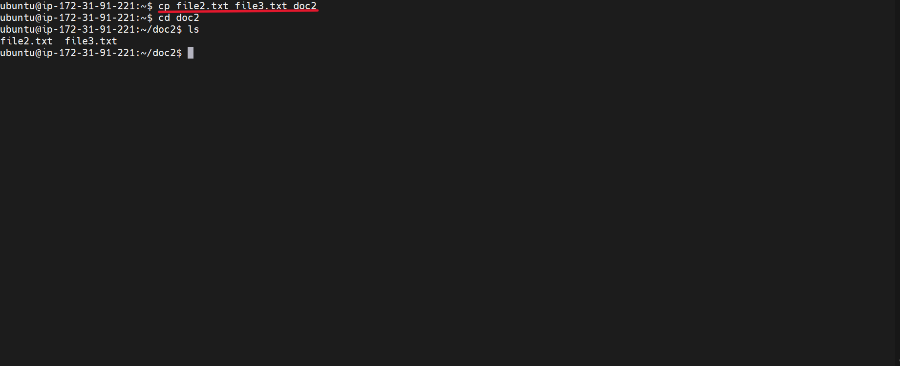

To copy the content of a file to a new file in the same directory, enter `cp` followed by the source file and the destination file. 

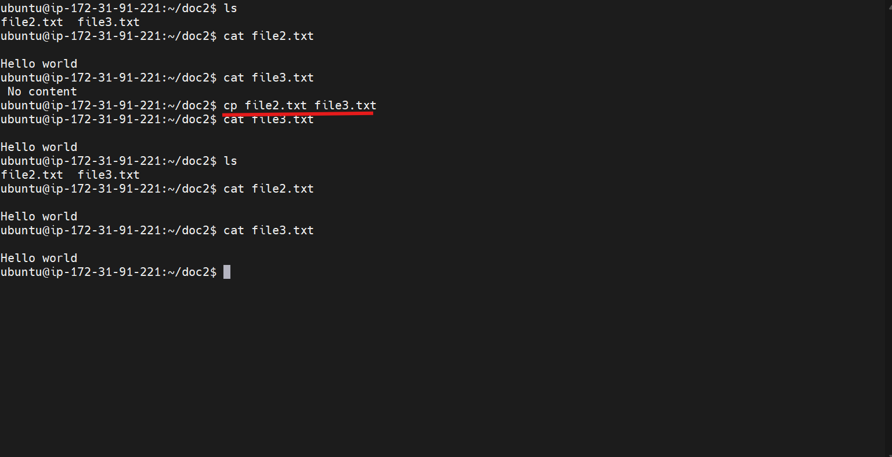

To copy an entire directory, pass the -R flag before typing the source directory, followed by the destination directory 


## mv command

The primary use of `mv` command is to move and rename files and directories. Additionally, it doesnt produce an output upon execution. 

Simply type `mv` followed by the filename and the destination directory


To rename a file with the `mv` command


## rm command

The `rm` command is used to delete files within a directory.

**Caution:** It deletes files completely. So must be used with care.


To remove a single file:
```
rm filename
```
<br>


To remove multiple files:
```
rm filename1 filename2 
```
<br>

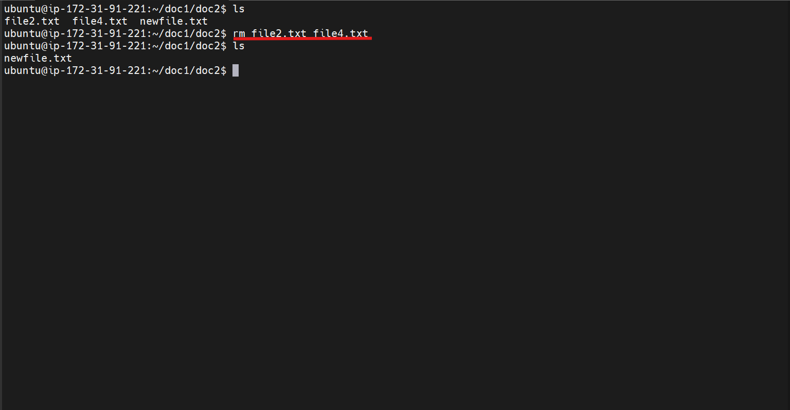

Here are some acceptable options one can add:
```
-i prompts system confirmation before deleting a file. (Denotes "interractive")
-f allows the system to remove without a confirmation. (Denotes "force")
-r deletes files and directories recursively.

```

## touch command 

The touch command allows to create an empty file or files.

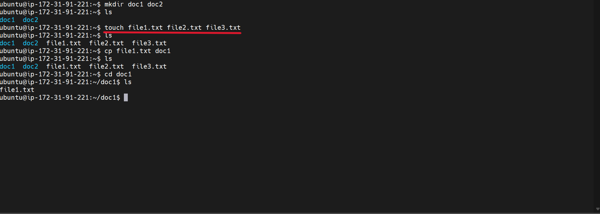

## find command

The find command is used to search for files within a specific directory and perform subsequent operations.Here's the general syntax
```
find [option] [path] [expression]

```

