# Linux Text Editors

A Linux text editor is a software application specifically designed for creating, modifying, and managing text files on a Linux-based operating system.

Text editor play a crucial role in the Linux environment, providing a means for users to interact with and manipulate plain text files, configuration files, and scripts, and other text-based documents.

There are verious text editors available in the Linux ecosysystem, each has its own set of features and user interface. Some example of Linux text editor incluse Vim (vi), Edamc, Nano etc.


## Vim Text Editor
The Linux text editor, short for "Vi Improved", is a powerful and versatile text editing tool deeply ingrained in the Unix and Linux ecosystems. Vim builds upon the foundation of the original Vi editor, offering an extensive set of features, modes, and commands that empower users to manipulate text efficiently.

While Vim has a steeper learning curve compared to simpler editors like Nano. it capabilities makes it a favorite among tech professionals and anyone working extensively with with text files.

### Working with Vim Editor

- **Open a new file** named ***exercise.txt*** using the following command:
```
vim exercise.txt
```
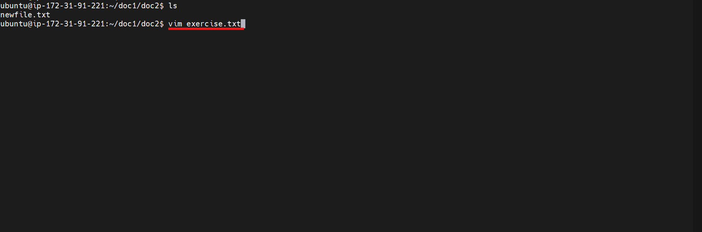

The command above creates an ***exercise.txt*** even if it doesn't exist, then opens it up 

- **Enter Insert Mode** by clicking the `i` letter to edit the file
and type the following text into it
```
Hello, this is a Vim hands-on project.
Welcome to darey.io.
```

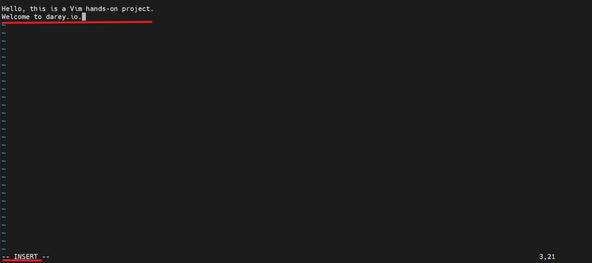

- ### Moving Around

Navigate throught the vim by using
The arrow keys or :

- h key (left)

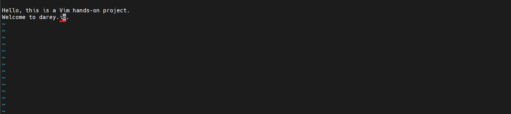
- j key (down)

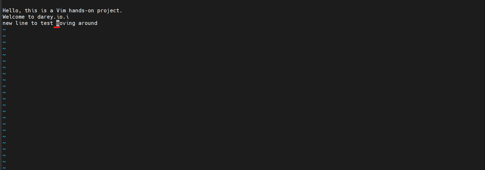
- k key (up)


- l key (right)


### Deleting a Character
Press the `esc` on the keyboard to exit `insert` mode. Position the cursor on a character to be deleted and press x

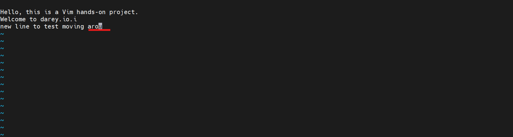

### Deleting a Line

To delete an entire line in a file, ensure that its not in `insert` mode then place the cursor on a line and press d twice on the keyboard

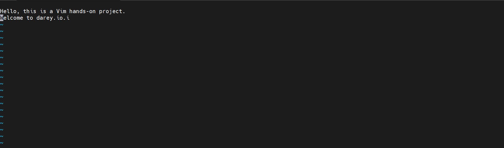

### Undoing Changes

Make a change (add or delete text) in insert or normal mood, then press esc to get to normal mood. then
press `u` to undo the last change

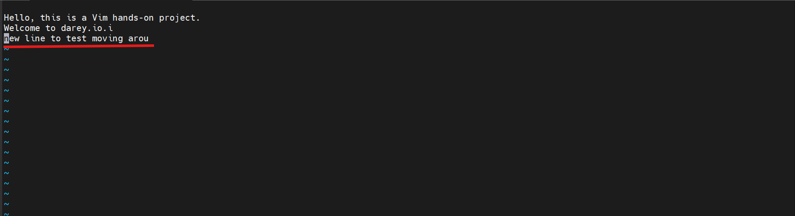

### Saving Changes

After finishing writing into a file, press `esc` then type **:wq** and press enter. This will save the file and basically quits the vim mode and returns back to the terminal. 

**Note:** **'w'** means **write** and **'q'** means quit

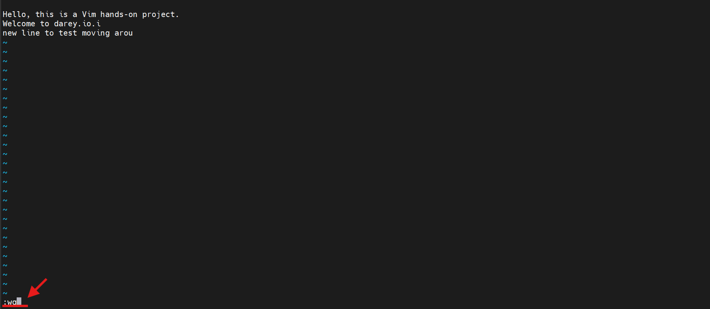

### Quiting without Saving

Simply Press `esc` then type **:q!** and press enter to quit without saving changes

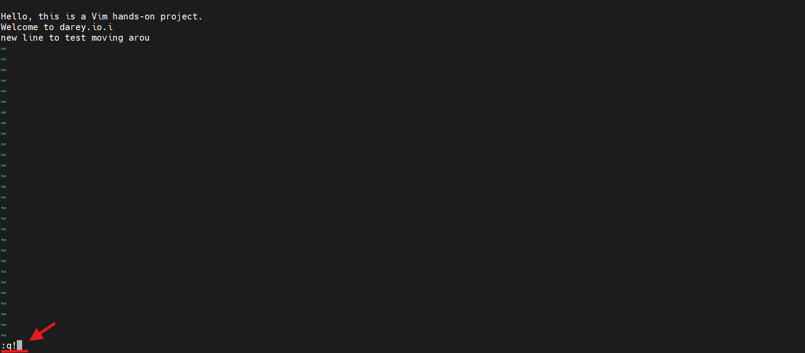

<br>

## Nano Text Editor

Among Linux text editors, Nano stands out as a user-friendly and straightforward tool, making it an excellent choice for users who are new to the command line or those who prefer a more intuitive editing experience

### Working with Nano Text Editor

**Open a file** named **'nano_project.txt'** using the following command
```
nano nano_file.txt
```

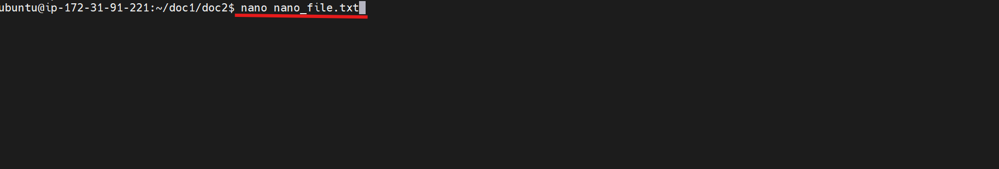

### Entering and Editing Text

Type a few lines of text into the file.

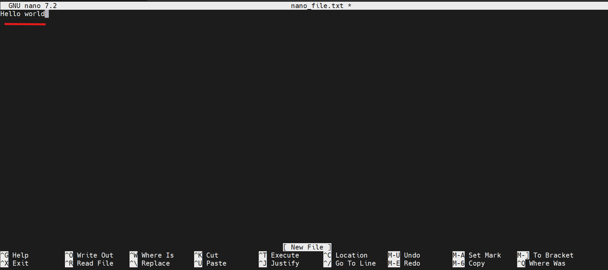

### Saving Changes

Save your changes by pressing the `ctrl` + `o`. Nano will prompt to confirm the filename; press `Enter` to confirm.

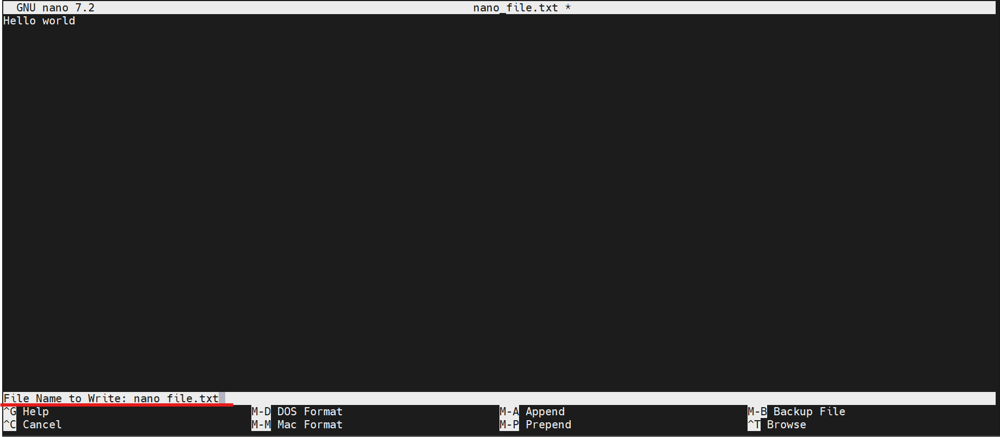

### Exiting Nano

To exit nano without saving the file simply press `ctrl` + `x`. if there is unsaved changes, Nano will prompt you to save before exiting

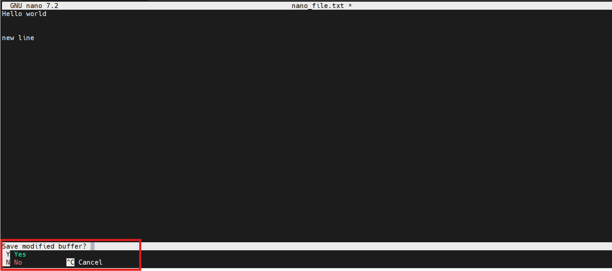

### Opening an Existing file

Open an existing file if available using the following command
```
nano existing_file.txt
```

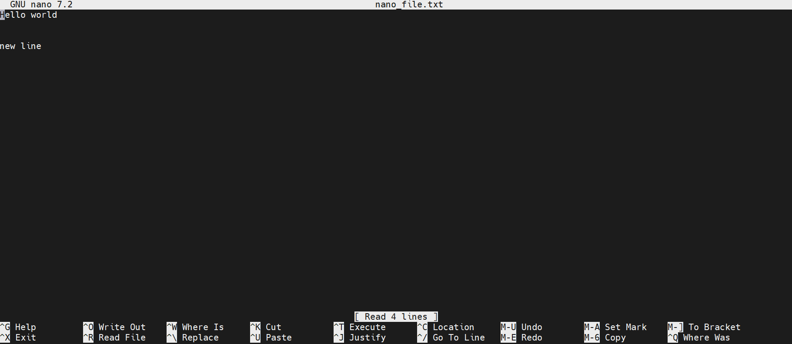