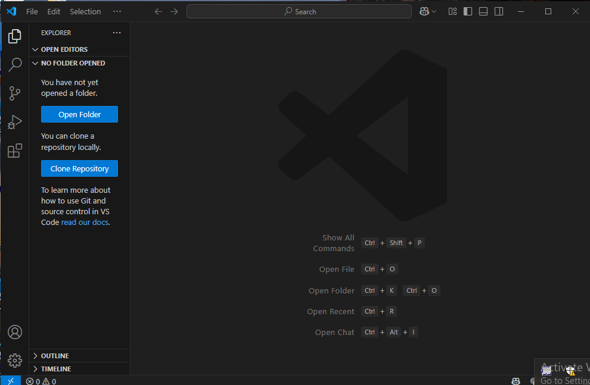
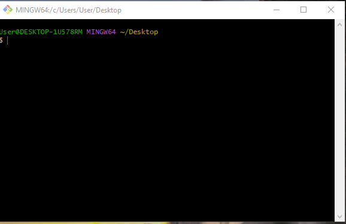
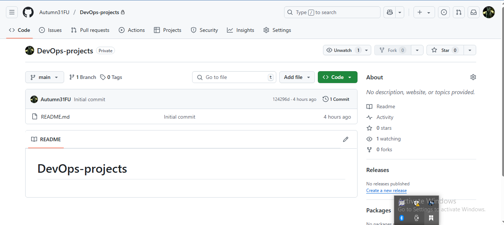
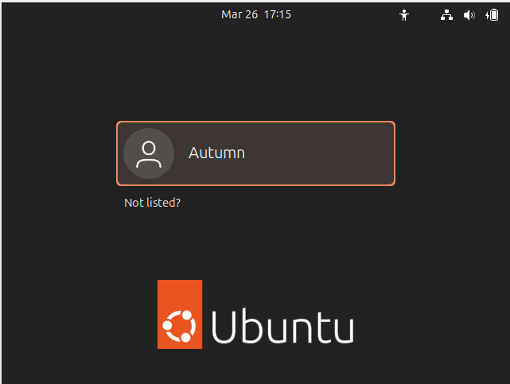
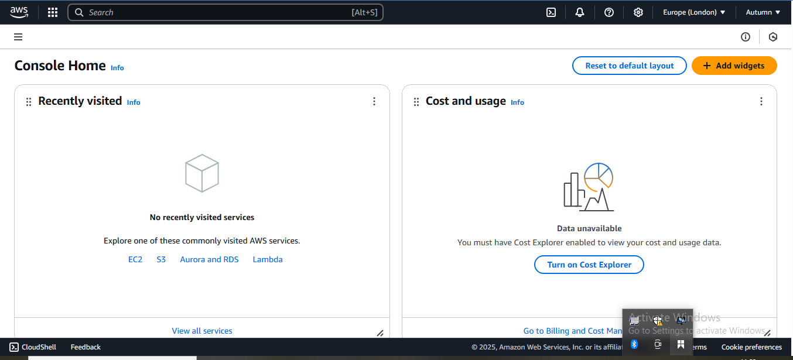

## DevOps Mini Project
This markdown contains screenshots of the Tech environment setup for Darey.io DevOps course

- ### Visual Studio Code (VScode)

- ### Git
 

- ### Github
 

- ### Virtual Box
 

- ### Ubuntu
 

- ### Amazon Web Services (AWS)
 

